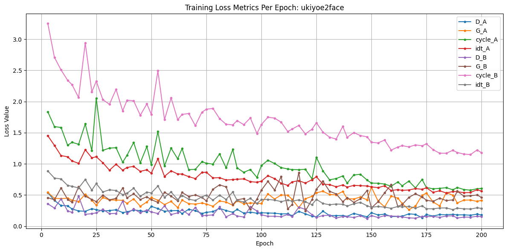

# Style-Transfer

**Authors: Kerr Tan, William Cheng, Zitong Luo**

## Abstraction

This project explores generative adversarial networks by replicating the findings of *Unpaired Image-to-Image Translation using CycleGAN* (Zhu et al., 2017). Building on the original framework, I introduced a new dataset of real portraits sourced from [Kaggle: AI Face Dataset (3,000 images)](https://www.kaggle.com/datasets/shavaizbutt/ai-face-dataset-3000-images/data) as the domain B (real faces), while keeping the original artwork dataset as domain A (paintings). I retrained three separate CycleGAN models, each corresponding to a different artist—Ukiyo-e, Van Gogh, and Monet—and compared the results with those from the original pre-trained models. This approach enables a more targeted evaluation of style-to-face and face-to-style translation performance using a consistent and higher-quality face dataset.

## Results

### Training Result Loss Plot 

#### monet2face

#### vangogh2face

#### ukiyoe2face

The loss plot for the ukiyoe2face CycleGAN training illustrates the convergence behavior of various loss components over 200 epochs. Notably, the cycle consistency loss (`cycle_B`) starts off the highest and gradually decreases, indicating that the model is learning to reconstruct images in the reverse domain more effectively over time. The generator and discriminator losses (`G_A`, `D_A`, `G_B`, `D_B`) show more stable and lower magnitudes, which is expected as the adversarial training stabilizes. The identity losses (`idt_A`, `idt_B`) and `cycle_A` loss also decline, suggesting better preservation of content across domains. However, some fluctuation remains, especially in `G_B` and `cycle_B`, which might reflect the increased difficulty of mapping complex ukiyoe features to photorealistic portraits. Overall, the decreasing trend across losses demonstrates that the model is learning effectively, but there is still room for improvement in domain B reconstruction.

### Style Transfer Examples

#### Protrait in styles

#### Failure Cases

It's harder to generate realistic portraits from paintings than to generate paintings from portraits because paintings are abstract and stylized, often lacking the detailed facial structure, texture, and lighting present in real photos. This makes the reverse task—painting to photo—an ill-posed, one-to-many problem where the model must infer missing details. In contrast, translating a photo into a painting involves applying a known artistic style to a well-defined facial structure, which is a more straightforward task. Additionally, models like CycleGAN train on unpaired data, so they struggle more with reconstructing photorealistic images from highly varied and lossy artistic domains.